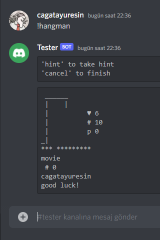
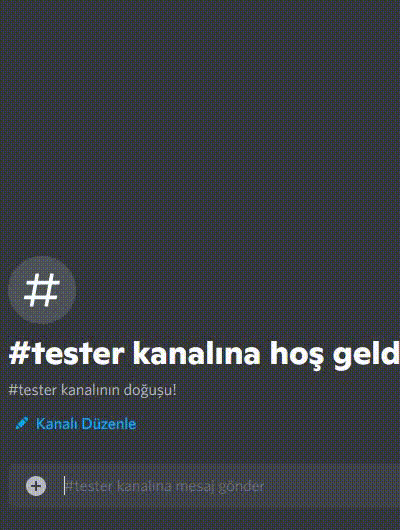

<a href="https://www.buymeacoffee.com/cagatayuresin" target="_blank"></a>

[https://cagatayuresin.com/discord-hangman/](https://cagatayuresin.com/discord-hangman/)

# HangMan - Discord Cog

A "cog" to play HangMan for Discord bots which is written in [discord.py](https://github.com/Rapptz/discord.py)

## Gameplay
Test prefix: `!`
1. `!hangman` - Starts the game



2. To guess a letter, just type a letter and send into the channel which is you started the game in.
3. To take a hint, type `hint` and send.
4. By the default you have 45 seconds to take action. After that, game stops.
5. **IMPORTANT!** While game is on if you type any message on the game channel the bot deletes it. It is always waits
for the message as an action for the game!
6. To finish the game without lose or win just type `cancel` and send.
7. Notification of last move at the bottom of the game panel. So if you guess not existing letter. You will notify.
8. When you guess the answer not letter, just type your answer and send. 



## Configurations
At `hangman_conf.json` file you can edit the game parameters.

```json
{
  "point_config" : {
    "HP": 6,
    "letter_point": 5,
    "not_exist_letter": -3,
    "known_letter_penalty": -20,
    "out_of_charset_guess": -10,
    "one_shot_multiplier": 5,
    "one_shot_penalty": -20,
    "hint_penalty": -5
  },
  "censor_char": "*",
  "guess_time_out": 45,
  "charset": [
    "a", "b", "c", "d", "e", "f", "g", "h", "i", "j", "k", "l", "m",
    "n", "o", "p", "q", "r", "s", "t", "u", "v", "w", "x", "y", "z"
  ]
}
```
For example, you have a dataset in another language, just change it with that language's alphabet.
Or you can reduce the time-out duration as seconds. **Negative value will not work!**

## Injection of dataset for questions

There are multiple ways to do it.
* You can use an API
* You can use a database
* You can use csv format
* You can scrape web

But you should integrate as a dict type at this line in `hangman.py`:
```py
the_question = {
    'name': 'The Godfather',
    'category': 'Movie',
    'hints': [
        'This movie has a very good IMDb point.',
        'Al Pacino plays.',
        'A 1972 movie.'
    ]
}
```
This is the format of a question. So you can create a data, 
or you can edit the source code according to dataset that you found.

## Contribute

Feel free to contribute this project.

## Licence

[MIT]()

Copyright 2022 Cagatay URESIN

Permission is hereby granted, free of charge, to any person obtaining a copy of this software and associated
documentation files (the "Software"), to deal in the Software without restriction, including without limitation the 
rights to use, copy, modify, merge, publish, distribute, sublicense, and/or sell copies of the Software, and to permit 
persons to whom the Software is furnished to do so, subject to the following conditions:

The above copyright notice and this permission notice shall be included in all copies or substantial portions of the 
Software.

THE SOFTWARE IS PROVIDED "AS IS", WITHOUT WARRANTY OF ANY KIND, EXPRESS OR IMPLIED, INCLUDING BUT NOT LIMITED TO THE 
WARRANTIES OF MERCHANTABILITY, FITNESS FOR A PARTICULAR PURPOSE AND NON INFRINGEMENT. IN NO EVENT SHALL THE AUTHORS OR 
COPYRIGHT HOLDERS BE LIABLE FOR ANY CLAIM, DAMAGES OR OTHER LIABILITY, WHETHER IN AN ACTION OF CONTRACT, TORT OR
OTHERWISE, ARISING FROM, OUT OF OR IN CONNECTION WITH THE SOFTWARE OR THE USE OR OTHER DEALINGS IN THE SOFTWARE.

